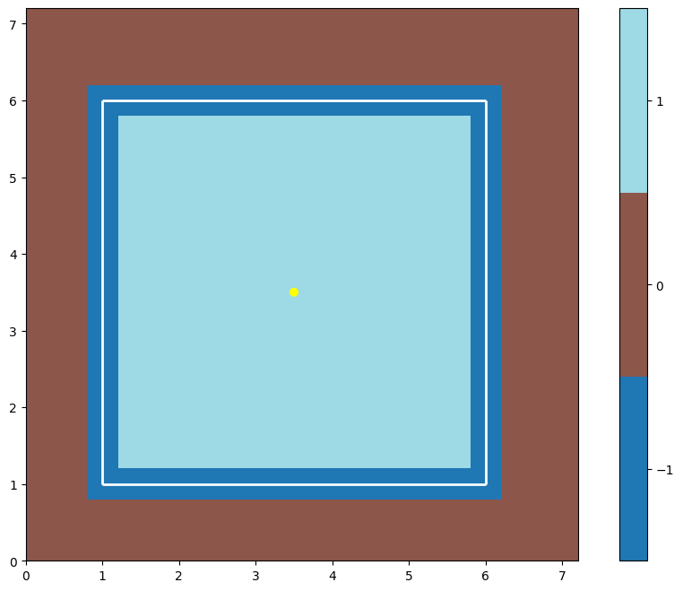
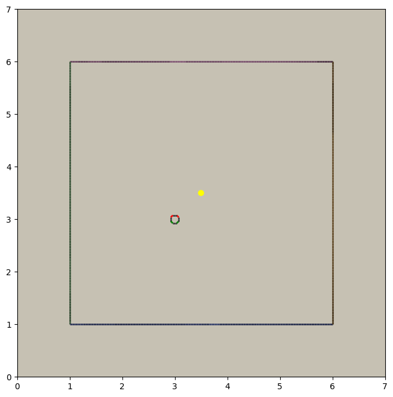
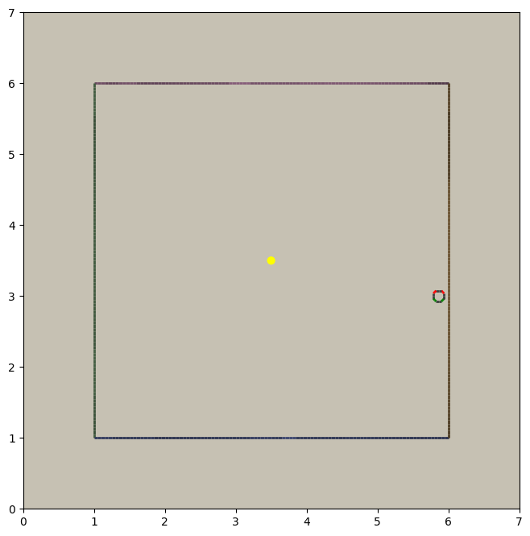
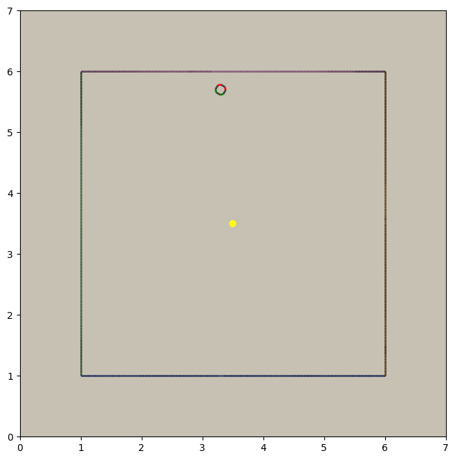

.. _minimal-env:

=============================
A Minimal Environment
=============================

In this tutorial we're going to write the simplest possible environment. We're going to make something that has an 
agent moving around and getting visual observations of the world around it. We're going to be able to record animations
of that agent's exploration, and we're going to generate a neural net that can control it. 

.. raw:: html

    <video controls src="/_static/minimal.mp4" autoplay loop muted type="video/mp4" width=640></video>

It might not look like much, but this is the basis off which we'll later build an :ref:`exploration env
<exploration-env>` and an :ref:`deathmatch env <deathmatch-env>`. Getting this boring little environment working
first will let us discuss a lot of the fundamentals of megastep without getting caught up in the details of a
specific task.

This is a very detailed tutorial. If you'd prefer to explore the libary on your own, see the 
:ref:`Playing With Megastep <playing>` page.

Setup
*****
It'd a good idea to open yourself a `Jupyter notebook <https://jupyter.org/install>`_ or `colab
<https://colab.research.google.com/>`_ and copy-paste the code as you go, experimenting with anything you don't quite
understand.

Once you've got your notebook up and running, the first thing to do is to :ref:`install megastep <install>`,
and the extra demo dependencies, which should be as simple as running ::

    !pip install git+https://github.com/andyljones/megastep[cubicasa,rebar] --yes

in a cell.

Geometry
********
The place to start is with the :ref:`geometry <geometry>`. The geometry describes the walls, rooms and lights of
an environment. In later tutorials we're going to generate thousands of unique geometries, but here for our
simplest-possible env, a single geometry will do. A single, simple geometry::

    from megastep import geometry, toys

    g = toys.box()
    geometry.display(g)

Yup, it's a box. Four walls and one room. There's :ref:`more below about how the geometry is made <custom-geometry>`,
and also a :ref:`brief discussion of its place in megastep <geometry>`.

Scenery
*******
A geometry on its own is not enough for the renderer to go on though. For one it's missing texture, and for two it only 
describes a single environment, when megastep's key advantage is the simulation of thousands of environments in parallel.
To turn the geometry into something the renderer can use, we turn it into a :class:`~megastep.cuda.Scenery`::

    from megastep import scene
    geometries = 128*[toys.box()]
    scenery = scene.scenery(geometries, n_agents=1)

    scene.display(scenery, e=126)

.. image:: scenery.png
    :alt: A visualization of a box scenery
    :width: 400

This code creates scenery for 128 copies of our box geometry, each with a randomly-chosen colourscheme and texture.
One copy - copy #126 - is shown. You'll also notice a :ref:`model of an agent has also been created and placed at the
origin <models>`. If you want to know more about what's going on here, there's :ref:`another brief discussion about
scenery <scenery>` and :ref:`a tutorial on writing your own scenery generator <tutorial-scenery>`.

Rendering
*********
With the scenery in hand, the next thing to do is create a :class:`~megastep.core.Core`::

    from megastep import core
    c = core.Core(scenery)

The Core doesn't actually do very much; there're little code in it and all its variables are public. It does do some
setup for you, but after that it's just a bag of useful attributes that you're going to pass to the physics and rendering
engines. 

One of things the core sets up is the :class:`~megastep.cuda.Agents` datastructure, which stores where the agents are.
You can take a look with

>>> import torch
>>> c.agents.positions
tensor([[[0., 0.]],
        ... 
        [[0., 0.]]], device='cuda:0')

but all it's going to tell you is that they're at the origin. megastep stores all its state in PyTorch tensors like 
these, and it's a-okay to update them on the fly. By default the origin is outside the box we've built, so as a 
first step let's put them inside the box ::

    c.agents.positions[:] = torch.as_tensor([3., 3.], device=c.device)

And now we can render the agents' view :: 

    from megastep import cuda
    r = cuda.render(c.scenery, c.agents)

This ``r`` is a :class:`~megastep.cuda.Render` object, which contains a lot of useful information that you can exploit
when desiging environments. Principally, it contains what the agents see ::

    from megastep import plotting
    im = (r.screen
            [[0]]            # get the screen for agents in env #0
            .cpu().numpy())  # move them to cpu & numpy
    plotting.plot_images({'rgb': im}, transpose=True, aspect=.1)

.. image:: render.png
    :alt: A visualization of the agent's viewpoint
    :width: 400

This is a 1-pixel-high image out from the front of the agent. You can read more about the rendering system in :ref:`this
section <rendering>`. As well as filling up the Render object, calling render does something else: it updates the
agents' models to match their positions. Having moved all the agents to (3, 3) earlier by assigning to
``c.agents.positions``, plotting the scenery again shows that the agents' models have moved from the origin to (3, 3):

    scene.display(scenery)

Physics
*******
Along with :func:`~megastep.cuda.render`, the other important call in megastep is :func:`~megastep.cuda.physics`. This
call handles moving agents based on their velocities, and deals with any collisions that happen. If we set the agents'
velocities to some obscene value, then make the physics call:

>>> c.agents.velocity[:] = torch.as_tensor([1000., 0.], device=c.device)
>>> p = cuda.physics(c.scenery, c.agents)
>>> c.agents.positions
tensor([[[5.8649, 3.0000]],
        ...
        [[5.8649, 3.0000]]], device='cuda:0')

we see that afterwards, the agents positions have been updated to where the right wall is. If we check the 
scenery right now though, the agents' models will still be at (3, 3) however. To update them, we need to call render
again:: 

    cuda.render(c.scenery, c.agents)
    scene.display(c.scenery)

A Skeleton
**********
We've now illustrated the basic loop in megastep::

    g = toys.box()
    scenery = scene.scenery(n_envs*[g], n_agents=1)
    c = cuda.Core(scenery)

    # set agent location
    r = cuda.render(c.scenery, c.agents)
    # generate an observation and send it to the agent
    while True:
        # process decisions from the agent
        p = cuda.physics(c.scenery, c.agents)
        # post-collision alterations
        r = cuda.render(c.scenery, c.agents)
        # generate an observation and send it to the agent

This loop will be hiding at the bottom of any environment you write. For the purposes of actually *using* the environment
though, that 'while' loop needs to be abstracted away. The typical way to do this follows from the `OpenAI Gym
<http://gym.openai.com/docs/#environments>`_, and while we're :ref:`not going to follow their interface exactly
<openai-gym>` we are going to steal the ideas of a 'reset' method and a 'step' method::

    class Minimal:

        def __init__(self, n_envs):
            geometries = n_envs*[toys.box()]
            scenery = scene.scenery(geometries, n_agents=1)
            self.c = cuda.Core(scenery)

        def reset(self):
            # set agent location
            r = cuda.render(self.c.scenery, self.c.agents)
            # generate an observation and send it to the agent
            return world

        def step(self, decision):
            # process decisions from the agent
            p = cuda.physics(self.c.scenery, self.c.agents)
            # post-collision alterations
            r = cuda.render(self.c.scenery, self.c.agents)
            # generate an observation and send it to the agent
            return world

This is exactly the same code as was in the loop, just with the interation with the agent made explicit through
:ref:`'decision' and 'world' variables <decision-world>`. This is very my syntactic sugar for agent-env interactions,
and while I think it works well, you're free to replace with your own. With this sugar though, the loop becomes much
more flexible::

    env = Minimal()
    world = env.reset()
    while True:
        decision = agent(world)
        world = env.step(decision)

Now all that's left to be done is to fill out those comment lines.

An Aside
********
Now that we're building up a class, it's going to be impractical for me to copy-paste the source every time I discuss
a change. Instead, you should grab the completed :class:`~megastep.demo.env.Minimal` class from megastep's demo module::

    from megastep.demo.envs.minimal import *
    self = Minimal()
    world = self.reset()

The remainder of the code segments will be small 'experiments' - for want of a better word - you can run on this env
to understand what's happening and why it's set up the way it is. If you want to play with the class's definition, 
then open an editor at ``self.__file__`` and copy-paste the contents into your notebook.

(You could alternatively edit it in-place, or copy it into a file ofyour own. Both of those however either require
restarting the kernel after each edit, or setting `autoreload
<https://ipython.org/ipython-doc/3/config/extensions/autoreload.html>`_ up. Autoreload is magical and absolutely
worth your time, but it is a tangent from this tutorial)

Spawning
********
Back to those comment lines! It's a good idea to work through them in order, since that means you can validate that
things are working as expected as you go. The first comment line is to 'set agent location'. We're going to want to
do this on the first reset, and then every time the agent collides with something and needs to be respawned at a new
location.

This is a pretty common task when building an environment, and so there's a :class:`~megastep.modules.RandomSpawns`
module to do it for you. It gets added to the env in ``__init__``, ::

    from megastep import modules
    self.spawner = modules.RandomSpawns(geometries, self.core)

and then you can call it with a mask of the agents you'd like to be respawned::

    reset = self.core.agent_full(True)
    self.spawner(reset)

As an aside, the :meth:`~megastep.core.Core.agent_full` and :meth:`~megastep.core.Core.env_full` methods will create
on-device tensors for you of shape (n_env, n

This will move each agent to a random position in the room. You can see this directly by inspecting ``self.core.agents.positions``,
or you can render and display it::

    self.core.render(self.core.scenery, self.core.agents)
    scene.display(self.core.scenery)

You can read more about how the respawning module works in the :class:`~megastep.modules.RandomSpawns` documentation.

Observations
************
The next comment is 'generate an observation and send it to the agent'. For our minimal environment, the 
observation will be a ye olde fashioned RGB (red-green-blue) camera, and again there's a module for that::

    self.rgb = modules.RGB(self.core)

This time, calling it gives you back a (n_env, n_agent, 3, 1, res)-tensor, suitable for passing to a PyTorch convnet::

    obs = self.rgb()

The render method is called internally by ``rgb``, saving us from having to do it explicitly ourselves. The class 
documentation for :class:`~megastep.modules.RGB` has more details on how it works.

Following the :ref:`decision-and-world <decision-world>` setup, this obs gets wrapped in a
:class:`~rebar.arrdict.arrdict` so that if we decide to nail any other information onto the side of our observations,
it's easy to do so. That means our ``reset`` method in all its glory is ::

    def reset(self):
        self.spawner(self.core.agent_full(True))
        return arrdict.arrdict(obs=self.rgb())

>>> self.reset()
arrdict:
obs    Tensor((128, 1, 1, 1, 64), torch.float32)

Actions
*******
The third comment is 'process decisions from the agent'. In our environment the action is simply whether to move 
forward/backward, left/right, or turn left/right. Once again, there's a module for this::

    self.movement = modules.SimpleMovement(self.core)

In the :ref:`decision-and-world <decision-world>` setup, the agent produces a ``decision`` arrdict with an
``"actions"`` key. The :class:`~megastep.modules.SimpleMovement` module expects the actions to be an integer tensor,
with values between 0 and 7. Each integer corresponds to a different movement. We can mock a decisions dict easily
enough::

    decision = arrdict.arrdict(actions=self.core.agent_full(3))

and calling the movement module will shift the agents forward::

    self.movement(decision)

As with the ``depth`` module, the ``movement`` module makes the ``physics`` call internally, again saving us from having
to do it ourselves. Like before, the class documentation for :class:`~megastep.modules.SimpleMovement` has more details 
on how it's implemented.

Having implemented both actions and observations, we can now assemble our ``step`` method::

    def step(self, decision):
        self.movement(decision)
        return arrdict(obs=self.rgb())

Agent
*****
That's it. That's the functional part of the environment done. All that's left is to wire up an agent to it, and
then watch it run. 

When you're doing reinforcement learning research, it helps if when you change the observations your environment emits,
or the action spaces your environment takes, the network you're using to run your agent adapts automatically. The 
megastep way to do this is to set ``.obs_space`` and ``.action_space`` on your environment, and then use a library of
:mod:`~megastep.demo.heads` to automatically pick the inputs and outputs of your network.

Using heads to create a network looks like this::

    intake = heads.intake(env.obs_space, width)
    output = heads.output(env.action_space, width)

You ask for an intake that conforms to the observation space, and outputs a vector of a specified width. Similarly, 
you ask for an output that takes a vector of a specified width and conforms to the action space. Then all that's left
to do is to nail one onto the other::

    policy = nn.Sequential(intake, output)

This network will spit out log-probabilities though, when our environment is expecting actions sampled from the 
distribution given by the log-probabilities. Fortunately the output space knows exactly how to do this::

    logits = policy(world.obs)
    actions = output.sample(logits)
    decision = arrdict.arrdict(logits=logits, actions=actions)

or, all together::

    class Agent(nn.Module):

        def __init__(self, env, width=32):
            super().__init__()
            self.intake = heads.intake(env.obs_space, width)
            self.output = heads.output(env.action_space, width)
            self.policy = nn.Sequential(self.intake, self.output)
            
        def forward(self, world):
            logits = self.policy(world.obs)
            actions = self.output.sample(logits)
            return arrdict.arrdict(logits=logits, actions=actions)

Trying It Out
*************
We've now got enough to exercise everything together::

    env = Minimal()
    agent = Agent(env).cuda()

    world = env.reset()
    decision = agent(world)

    world = env.step(decision)

Hooray! When you're writing your own environments, you'll likely find yourself running this chunk of code more often
than any other. It's about the smallest snippet possible that sets everything up and runs through ``reset``,
``forward``, and ``step``. If you've got a bug somewhere, most of the time this snippet will tell you about it.

Recording
*********
Having the code run isn't the same as watching it run however. To watch it run, we need to repeatedly step and plot the 
environment, then string all the plots together into a video.

In megastep, the recommended way to plot your environment is a two-part process: first, write a method that 
captures all the state of the environment in a single dict. Then, write another method that takes this state dict
and generates the plot. You can read more about why this is a good idea :ref:`here <plotting>`, but the short of it is
that plotting is frequently much slower than stepping the environment, and putting the slow part in it's own method 
means we can do it in parallel.

First up, the state method. It simply combines the states of the relevant modules::

    def state(self, e=0):
        return arrdict.arrdict(
            **self.core.state(e),
            rgb=self.rgb.state(e))

The ``e`` is because we're typically only interested in plotting a single env at a time, and so we only need to extract 
the state for one env - in this case, env #0. 

Next, the plotting method. This can be any combination of matplotlib calls you like, as long as it returns a figure::

    def plot_state(self, state):
        fig = plt.figure()
        gs = plt.GridSpec(3, 1, fig)

Finally, we can record a video::

    from rebar import recording

    env = Minimal()
    agent = Agent(env).cuda()

    with recording.ParallelEncoder(env.plot_state) as encoder:
        world = env.reset()
        for _ in range(64):
            decision = agent(world)
            world = env.step(decision)
            
            encoder(arrdict.numpyify(env.state()))

    encoder.notebook()

.. raw:: html

    <video controls src="/_static/minimal.mp4" autoplay loop muted type="video/mp4" width=640></video>

Here we're executing the same loop as before, just at the bottom of it we're pulling out the state and feeding it to
the :class:`~rebar.recording.ParallelEncoder`.

Next Steps
**********
That's it! We've got a basic environment and an agent that can interact with it. The next step is to actually define
a task of some sort and then train the agent to solve the task. To learn how to do that, move on to the
:ref:`exploration env tutorial <exploration-env>` or the :ref:`deathmatch env tutorial <deathmatch-env>`.